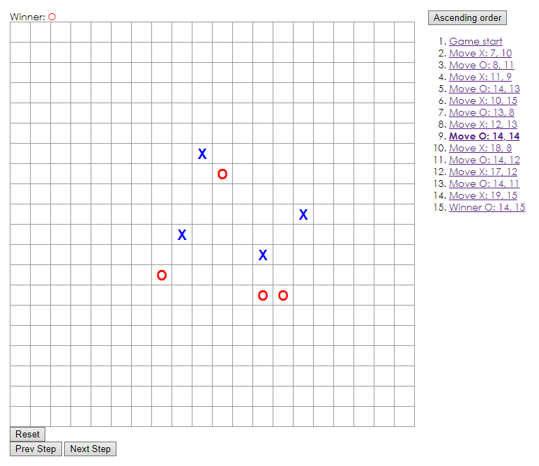
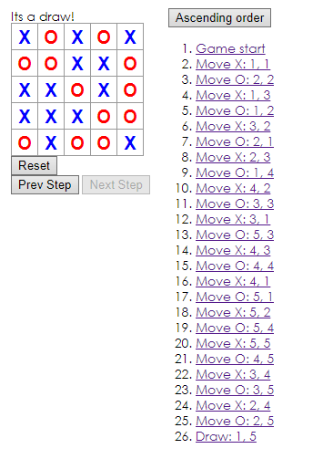

# React Gomoku

Enchanced version of the [official React tutorial](https://facebook.github.io/react/tutorial/tutorial.html).

Enhancements:
- Display the location for each move in the format (col, row) in the move history list.
- Bold the currently selected item in the move list.
- Rewrite Board to use two loops to make the squares instead of hardcoding them. Rewrite the winning rule to 5 consecutive squares.
- Reset button with confirmation
- Can go backward and forward in history
- Add a toggle button that lets you sort the moves in either ascending or descending order.
- 20x20 board
- Highlights winning squares
- When no one wins (every square is filled), display a message about the result being a draw.

It looks like this:

